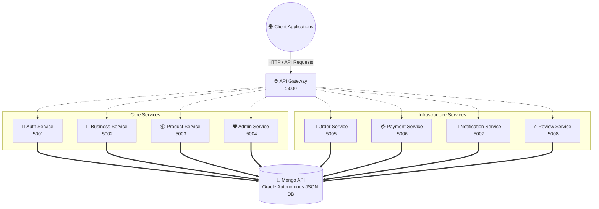
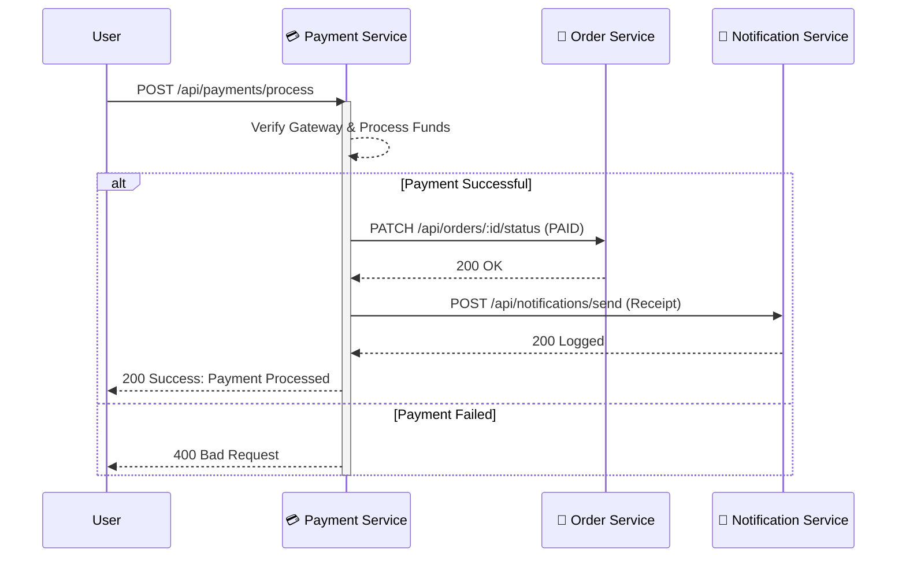

<div align="center">
  
  
  
  
  
  
  
  <br/>
  <h1>🚀 NexusCart Microservices Backend</h1>
  <p><b>An ultra-modern, highly scalable, and completely decoupled E-Commerce Backend.</b></p>
</div>

---

## 🌟 Overview
NexusCart is a robust multi-vendor E-Commerce platform. Its backend is built using a **pure Microservices Architecture** consisting of 8 independent services and 1 API Gateway. It utilizes internal network routing and asynchronous HTTP communication to ensure maximum decoupling and scalability.

This repository is **Azure Container Apps (ACA)** deployment-ready with standardized Dockerfiles and dynamic environment variable routing.

---

## 🏗️ Architecture Topography

Below is the overarching topology of the NexusCart cluster. The API Gateway serves as the single public entry point, securely proxying requests to internal, isolated microservices.



---

## 🔄 Internal Event Flow (Example: Checkout Process)

NexusCart uses asynchronous inter-service communication (via Axios). Microservices do not share database schemas; instead, they verify and update states through secure internal REST endpoints.



---

## 📧 Transactional Email (Brevo)

The **Notification Service** and **Auth Service** send all transactional email through the [Brevo](https://www.brevo.com/) API (`@getbrevo/brevo`) — registration/reset OTP codes, order confirmation, order status updates, and invoices. This replaced a per-service Gmail/Nodemailer setup that depended on an app password.

- **`auth-service`** calls Brevo's dynamic-template API directly (`BREVO_OTP_TEMPLATE_ID`, `BREVO_RESET_TEMPLATE_ID`) for registration and password-reset codes — both are code-based (a 6-digit code entered in the app), not link-based.
- **`notification-service`** owns `src/services/brevoEmailService.ts`, a reusable module (`sendOTPEmail`, `sendPasswordResetEmail`, `sendInvoiceEmail`, `sendRawEmail`) that either renders branded inline HTML or routes through a Brevo dynamic template when `BREVO_*_TEMPLATE_ID` is set. Reference markup for the dashboard-managed templates lives in `src/templates/brevo/*.html`.
- Order confirmation and status-change emails are still rendered locally (`utils/emailTemplates.ts`) and sent through `sendRawEmail` — same brand shell, sent via Brevo instead of Nodemailer.

Below is the invoice email as an actual recipient sees it (rendered from `notification-service/src/templates/brevo/invoice.html` with sample data):

<p align="center">
  
</p>

Required env vars (see `.env.example`): `BREVO_API_KEY`, `BREVO_SENDER_EMAIL`, `BREVO_SENDER_NAME`, plus the optional per-template IDs above and `FRONTEND_URL` (used to build invoice links in order emails).

---

## 💻 Tech Stack
- **Runtime:** Node.js (TypeScript)
- **Framework:** Express.js
- **Database:** Mongoose ODM over the Oracle Database API for MongoDB, backed by Oracle Autonomous JSON Database (previously Azure Cosmos DB)
- **Inter-Service Communication:** Axios (REST)
- **Authentication:** JWT (JSON Web Tokens)
- **Containerization:** Docker & Docker Compose
- **Cloud Readiness:** Microsoft Azure (Container Apps / ACR) for compute, Oracle Cloud Infrastructure for the database

---

## 🚀 Quick Start (Local Development)

### Prerequisites
- Node.js (v18+)
- MongoDB running locally on port `27017`

### 1. Installation
Install the dependencies for the root orchestrator:
```bash
npm install
```

Install dependencies for all 9 individual microservices:
```bash
npm run install:all
```

### 2. Environment Variables
Create a `.env` file in the root directory. You can copy the template:
```bash
cp .env.example .env
```
*(No need to configure service URLs for local development; they fallback to `127.0.0.1` automatically).*

### 3. Run the Cluster
Start the entire cluster using `concurrently`. This spins up the API Gateway and all 8 microservices simultaneously.
```bash
npm run dev
```

### 4. Interactive Documentation
Once the cluster is running, simply navigate to the API Gateway in your browser to view the **Developer Hub UI**:
👉 **http://localhost:5000/**

---

## 🐳 Docker Deployment

Every service contains a `Dockerfile` and is fully containerized. To build a specific service:

```bash
cd auth-service
docker build -t nexuscart-auth .
docker run -p 5001:5001 nexuscart-auth
```

> **Note on Environment Variables:** For production Docker deployments (like Azure Container Apps), ensure you set the specific Internal FQDN URL variables (e.g. `AUTH_SERVICE_URL`) in your cloud provider so the proxy can correctly route traffic between containers.

---
<div align="center">
  <i>Architected with ❤️ for modern E-Commerce</i>
</div>
