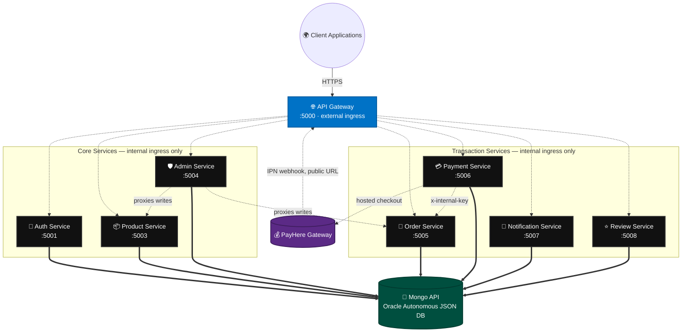
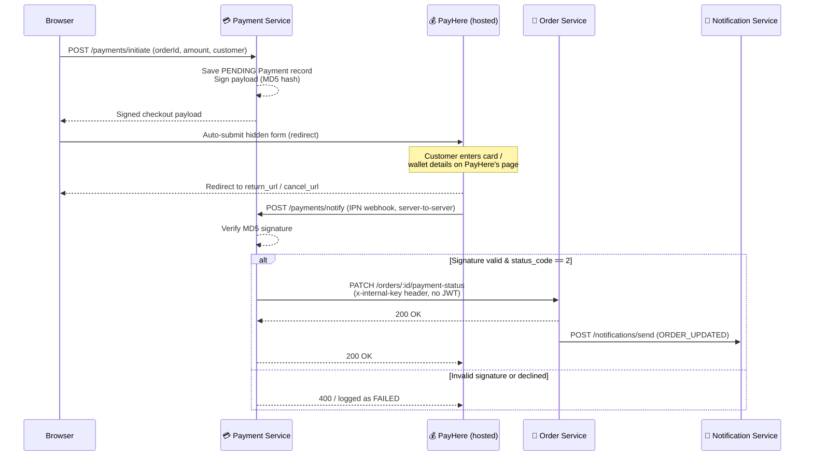
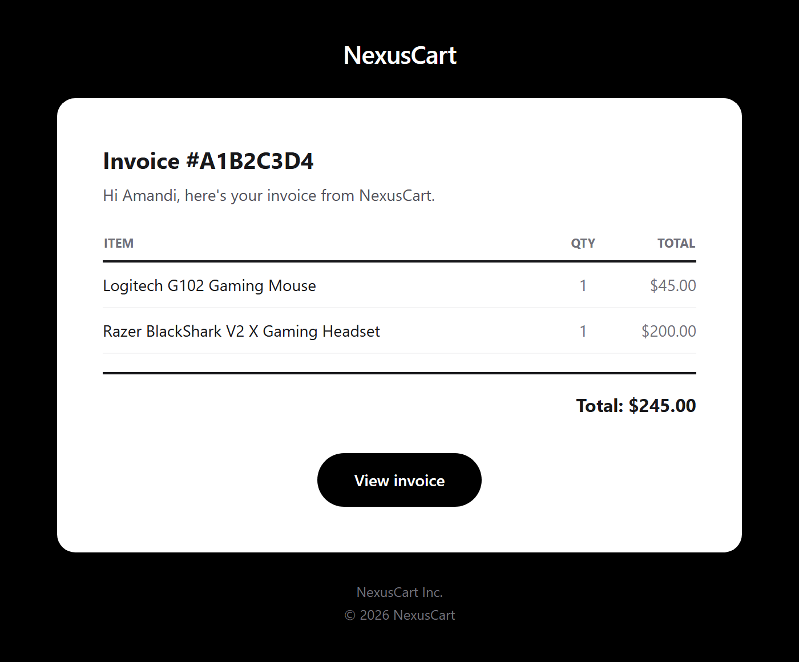

<div align="center">
  
  
  
  
  
  

  <br/>
  <h1>🚀 NexusCart Microservices Backend</h1>
  <p><b>An ultra-modern, highly scalable, and completely decoupled E-Commerce Backend.</b></p>
  <p>
    
    
    
    
    
  </p>
</div>

---

## 🌟 Overview

NexusCart's backend is a pure Microservices Architecture: 8 independent Node.js/Express services plus one API Gateway, communicating over internal Azure Container Apps networking via REST (Axios). No shared database, no shared code between services — each owns its own Mongoose models, even when the shape overlaps with another service's.

This repository is **Azure Container Apps (ACA)**-ready: every service has its own `Dockerfile`, and CI/CD path-filters each push so only the services that actually changed get rebuilt and redeployed.

---

## 🏗️ Architecture Topography



> **Note:** a 9th service, `business-service`, exists in this repo as a scaffold for a future multi-vendor marketplace (storefronts, vendor onboarding) but isn't part of the live platform yet — see [Roadmap](#-roadmap) below.

---

## 🔄 Internal Event Flow: PayHere Checkout

Payment processing is a real gateway integration, not a mock. The customer never enters card details on NexusCart's own servers — PayHere's hosted page handles that, and confirms payment back to the backend independently of the customer's browser session.



The IPN webhook is a server-to-server call from PayHere's own infrastructure — it carries no customer JWT, so it authenticates purely via the MD5 signature, and the resulting order-status update authenticates to `order-service` with a shared `x-internal-key` secret instead of a user token. `notify_url` points at the API Gateway's public FQDN directly, bypassing the frontend's Next.js proxy (which only forwards JSON bodies, not PayHere's `application/x-www-form-urlencoded` payload).

---

## 🔐 Role-Based Access Control

Two independent layers, deliberately kept separate:

- **Role** (`Customer` | `Admin`) gates whether an account can enter the admin console at all. Only one account — `SUPER_ADMIN_EMAIL` — can ever grant or revoke the `Admin` role, enforced server-side (`auth-service`, `admin-service`) regardless of what a client sends.
- **Permissions** (`products`, `orders`, `banners`, `promotions`, `settings`) gate which admin sections an `Admin` can actually use, and any admin can grant/narrow another admin's permissions — no super-admin requirement for that layer. The super admin implicitly passes every permission check.

Self-registration (`/auth/register`, `/auth/google`) always forces the `Customer` role server-side, closing off a self-promotion path that existed earlier in development.

---

## 📧 Transactional Email (Brevo)

Order and account emails go through the [Brevo](https://www.brevo.com/) API (`@getbrevo/brevo`), not raw SMTP:

- **`auth-service`** sends registration and password-reset OTP codes directly via Brevo's dynamic-template API (`BREVO_OTP_TEMPLATE_ID`, `BREVO_RESET_TEMPLATE_ID`) — both code-based, entered in the app.
- **`notification-service`** dispatches order confirmation and status-change emails (including the payment-confirmation email once an order flips to `PAID`), rendered from `utils/emailTemplates.ts` and sent through Brevo — with support for Brevo dashboard-managed dynamic templates as a drop-in alternative to the built-in inline HTML.

Below is the invoice email as an actual recipient sees it:

<p align="center">
  
</p>

Required env vars (see `.env.example`): `BREVO_API_KEY`, `BREVO_SENDER_EMAIL`, `BREVO_SENDER_NAME`, the optional per-template IDs above, and `FRONTEND_URL` (used to build invoice links in order emails).

---

## 🛠️ Deep Dive: The Microservices

### 1. API Gateway (`api-gateway`)
The sole public-facing entry point. Proxies `/api/*` to each internal service (`http-proxy-middleware`), handles CORS, and serves a live developer-hub page listing every route. Every other service runs with **internal-only** Azure ingress — this is the only one with an external FQDN.

### 2. Auth Service (`auth-service`)
Identity provider: registration + email OTP verification, login, Google OAuth, password reset — all JWT-issuing. Enforces the `Customer`-only self-service role and the `SUPER_ADMIN_EMAIL` auto-promotion rule described above.

### 3. Product Service (`product-service`)
The catalog core: products, categories, banners, promotions, currency settings, and live exchange rates (cached, with a stale-cache fallback). Stock adjustments are atomic (`$inc` + a `$gte` guard baked into the query) so concurrent orders can never push stock negative, with a capped movement history per product. Also owns the banner/product **template system** — 7 banner layouts and 8 product-rail layouts (`carousel`, `grid`, `spotlight`, `sidebar`, `showcase`, `bento`, `marquee`, plus `cinematic` for product rails), each independently positioned on the storefront.

### 4. Admin Service (`admin-service`)
The admin console's backend: user management + RBAC (role and per-section permissions), platform metrics, and an authenticated proxy layer that forwards product/order/banner/promotion/settings writes to their owning services after checking the caller's permissions.

### 5. Order Service (`order-service`)
Converts a cart into an order, computing the total server-side (never trusting a client-supplied amount). Tracks status (`PENDING → PAID → SHIPPED → DELIVERED`, or `CANCELLED`) and exposes a shared-secret-authenticated internal route so `payment-service` can mark an order paid without ever holding a customer's JWT.

### 6. Payment Service (`payment-service`)
A real **PayHere** integration (Sri Lanka's Central-Bank-approved payment gateway) — see the sequence diagram above. Builds MD5-signed hosted-checkout payloads and verifies PayHere's IPN webhook signature before ever trusting a "payment succeeded" signal.

### 7. Notification Service (`notification-service`)
A decoupled worker that listens for internal events (`ORDER_CREATED`, `ORDER_UPDATED`) and dispatches branded transactional email via Brevo. Also logs every notification attempt per user.

### 8. Review & Rating Service (`review-rating-service`)
Product reviews and star ratings, scoped to authenticated buyers.

### 9. Business Service (`business-service`) — 🚧 scaffolded, not yet live
Storefront/vendor-onboarding models and routes exist (business registration, storefront customization, public storefront lookup), but the platform's role model only recognizes `Customer`/`Admin` today — there's no `Vendor` role to reach the protected routes with, and `api-gateway` doesn't proxy `/api/business` yet. Kept in the repo as the foundation for a future multi-vendor marketplace.

---

## 💻 Tech Stack

- **Runtime:** Node.js (TypeScript)
- **Framework:** Express.js
- **Database:** Mongoose ODM over the Oracle Database API for MongoDB, backed by Oracle Autonomous JSON Database (previously Azure Cosmos DB — see [`docs/OCI_MIGRATION.md`](./docs/OCI_MIGRATION.md))
- **Inter-service communication:** Axios (REST), plus a shared-secret header for the one JWT-less internal call
- **Authentication:** JWT, Google OAuth (`google-auth-library`)
- **Payments:** PayHere (MD5-signed hosted checkout + IPN webhook)
- **Transactional email:** Brevo (`@getbrevo/brevo`)
- **Containerization:** Docker, one image per service
- **Cloud:** Microsoft Azure (Container Apps + ACR) for compute, Oracle Cloud Infrastructure for the database

---

## 🚀 Quick Start (Local Development)

### Prerequisites
- Node.js 18+
- A MongoDB-API-compatible database (local MongoDB, Cosmos DB, or Oracle Autonomous JSON DB)

### 1. Install
```bash
npm install          # root orchestrator
npm run install:all  # all 9 services
```

### 2. Configure environment
```bash
cp .env.example .env
```
Fill in `MONGO_URI`, `JWT_SECRET`, `SUPER_ADMIN_EMAIL`, your Brevo credentials, and — if you want working payments locally — a PayHere **Sandbox** Merchant ID/Secret plus `INTERNAL_SERVICE_KEY` (must match across services) and `API_GATEWAY_PUBLIC_URL` (PayHere's webhook needs a public URL — use [ngrok](https://ngrok.com/) for local testing). Service-to-service URLs fall back to `127.0.0.1` automatically for local dev.

### 3. Run the cluster
```bash
npm run dev
```
Spins up the API Gateway and all services concurrently.

### 4. Interactive docs
👉 **http://localhost:5000/** — a live developer hub listing every service and route.

---

## 🐳 Docker Deployment

```bash
cd auth-service
docker build -t nexuscart-auth .
docker run -p 5001:5001 nexuscart-auth
```

For Azure Container Apps, set the internal-FQDN `*_SERVICE_URL` variables so the gateway (and services that call each other, like `payment-service` → `order-service`) can resolve one another inside the environment's virtual network.

---

## ☁️ CI/CD

Every push to `main` triggers a **GitHub Actions** workflow (`.github/workflows/deploy-backend.yml`) that path-filters per service — only the services whose files actually changed get rebuilt, pushed to Azure Container Registry, and rolled out to their Container App, with a post-deploy health check before the job succeeds.

Secrets (`MONGO_URI`, `JWT_SECRET`, `PAYHERE_MERCHANT_SECRET`, etc.) live as Azure Container Apps environment variables, set manually per service — they are **not** synced from this repo's `.env`/CI on every deploy, so a new secret needs to be added to the live container explicitly.

---

## 🗺️ Roadmap

- Wire `business-service` into the live platform: add a `Vendor` role, proxy `/api/business` through the gateway, and connect merchant storefronts to the product catalog.
- Route the `PAYMENT_SUCCESS` notification event to a dedicated payment-receipt email template (order-status emails already cover the PAID transition today).
- Internal-key-gate `notification-service`'s `/send` endpoint, matching the pattern already used for `order-service`'s payment-status route.

---
<div align="center">
  <i>Architected with ❤️ for modern E-Commerce</i>
</div>
